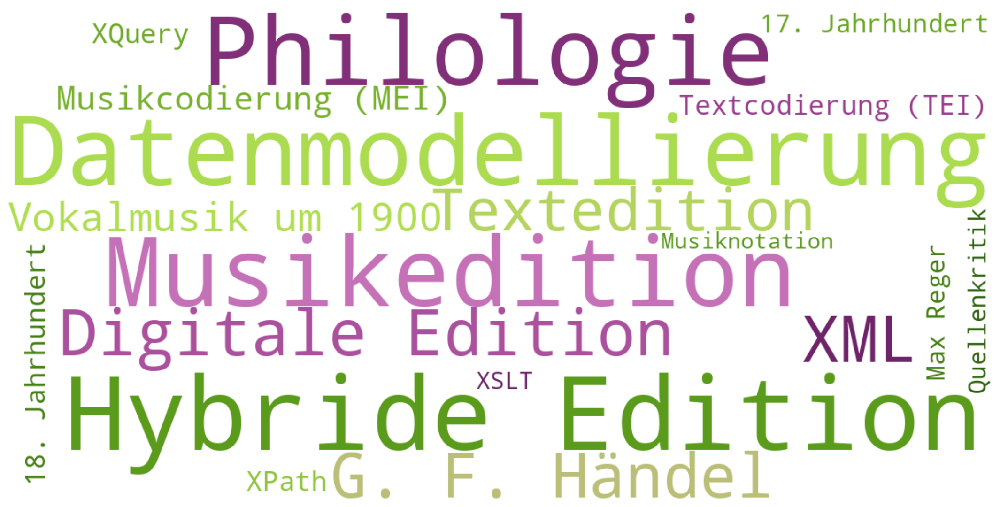

<!--
author:   Dennis Ried
email:    dennis.ried@musikwiss.uni-halle.de
version:  1.0.0
language: de
narrator: Deutsch Female
mode:     Presentation
import:   ./liascript-config.md
link:     ./liascript-style.css
link:     https://fonts.googleapis.com/css2?family=Source+Sans+3:ital,wght@0,200..900;1,200..900&display=swap
font:     Source Sans 3
tags:     thesis, edition, music
-->

# Musikedition als M.A.-Thesis

---

<!--
style="width: 75%; max-width: 300px"
title="Kilroy-Ewbank, Lauren: *Medieval Heart-Shaped Books. The Ultimate Valentine?*, 12.02.2025."
-->
Bei Musikeditionen handelt es sich um ein tradiertes Verfahren zur Herstellung kritischer Notentexte. In ihrer langen Tradition hat die Methodik stets neue Impulse erfahren, die es zu berücksichtigen gilt. Nicht zuletzt ist der Gegenstand, den wir bearbeiten eine künstlerische Lösung für eine bestimmte Problemstellung. Daher ist Edition niemals nur „Schema-F“ – die Methodik der Edition muss an den individuellen Forschungsgegenstand angepasst werden.

---
<!-- style="font-size:smaller;" -->
Bild: Kilroy-Ewbank, Lauren: *Medieval Heart-Shaped Books. The Ultimate Valentine?*, 12.02.2025.

> Da das Themenfeld Edition im Studium zwar grundlegend behandelt wird, aber keine Möglichkeit besteht ausgiebige Praxiserfahrung zu sammeln, ist eine umfassende Betreuung notwendig. Ich arbeite mit Ihnen ein individuelles Betreuungskonzept aus, um die bestmöglichen Rahmenbedingungen für eine erfolgreiche Umsetzung Ihres Projektes zu schaffen.

---
<!-- style="text-align:right;" -->
*Jun.-Prof. Dr. Dennis Ried*

## Voraussetzungen
Um eine Musikedition als M.A.-Thesis anfertigen zu können, sind Grundkennisse und erste Erfahrungen im Bereich der Musikedition zwingend nötig! Diese können durch den Besuch des M.A.-Moduls „Editionspraxis“, aber auch durch ein Praktikum in einem Editionsprojekt erworben werden.

> **Achtung!** Ohne Vorkenntnisse ist eine Musikedition als M.A.-Thesis nicht möglich. Gleiches gilt für digitale Musikeditionen.

---
Meine Spezialgebiete
---

<!-- style="width: 75%; padding-left: 10%; padding-top: 1%;"  -->

## Anforderungen

Ziel einer wissenschaftlich-kritischen Edition ist es einen **verlässlichen** und **verständlichen Notentext** anzufertigen, der als **Forschungsgrundlage** zur Bearbeitung weiterer Fragestellungen (wie bspw. Interpretation, Analyse, Rezeption usw.) dienen kann. Dazu ist eine *sorgfältige und strukturierte Arbeitsweise* nötig.

---
Das erwarte ich…
---

- sorgfältiges Arbeiten (Einhaltung von Formalia)
- regelmäßigen Austausch
  
  - Zwischenstandsberichte oder
  - Rückmeldung am Ende jeder Arbeitsphase

- sofortige Rücksprache bei unerwarteten methodischen Problemen

---
Das biete ich…
---

- Konsultation zu editorischen Problemen
- Feedback zu Struktur und Methodik (Edition)
- Feedback zu Formulierungen (Textteil)
- Einmalige Durchsicht des Kritischen Berichts mit Anmerkungen
- Bei schwierigen Fällen: Hilfestellung (Acquise, Recherche, Fallbeispiele)

---
Mein Grundkonzept (individuell anzupassen)
---
- Sondierung

  - Erörterung des Ziele
  - Themenfindung
  - Suche nach einem geeigneten Forschungsobjekt

- Vor der Anmeldung

  - Reflexion erster Rechercheergebnisse
  - Erörterung des Aufbaus der Edition
  - Formulierung der Themenstellung/des Titels
  - Aufstellung eines Projektplans

- [Anmeldung der Thesis](#anmeldung-der-ma-thesis)
- Ausarbeitung der Edition

  - jederzeit: Konsultation zu Befunden und Problemen
  - Ende jeder Arbeitsphase: Feedback zum aktuellen Stand

## Anmeldung der Thesis
Aktuelle Informationen zur Prüfungsanemldung finden Sie auf der Seite des [Prüfungsamtes](https://pruefungsamt.philfak2.uni-halle.de/)

> *Nehmen Sie die Fristen des Prüfungsamtes bitte ernst!*

- Anmeldung bis zum 15. eines Monats; Beginn zum 01. des Folgemonats.

  - Beispiel: Die Bearbeitungsphase soll am 01. März beginnen, damit ist die Einreichungsfrist für den Antrag der 15. Februar.
 
- Benötigte Unterlagen:

  - vollständig ausgefüllter und **unterschriebener** Zulassungsantrag (inkl. der **Unterschriften der Prüferinnen bzw. Prüfer**)
  - Immatrikulationsbescheinigung für das aktuelle Semester
  - ggf. Anlage zum Zulassungsantrag (wenn die erforderlichen Leistungspunkte erbracht, aber noch nicht im Löwenportal eingetragen sind)

> **Wichtig**: Eine Anmeldung der Abschlussarbeit zum **01. Januar** und **01. September** ist  ausgeschlossen, da der Studien- und Prüfungsausschuss in den Monaten Dezember und August nicht tagt und somit auch keine Themen vom Ausschuss in dieser Zeit bestätigt werden können.

---

**Genauer nachlesen:**

<iframe style="width:100%; min-height: 750px;" src="https://pruefungsamt.philfak2.uni-halle.de/allgemeineinformationen/" title="Prüfungsamt, MLU, PhilFakII"></iframe>

## Anhang
Nützliche Informationen

### Literaturempfehlung
Edition (allg.)
---
- Die Editionsrichtlinen und Vorworte der Gesamt- und Werkausgaben
- Appel, Bernhard R./Emans, Reinmar: *Musikphilologie. Grundlagen – Methoden – Praxis* (= Kompendien Musik, Bd. 3), Laaber 2017.
- Plachta, Bodo: *Editionswissenschaft*, 3. ergänzte und aktual. Aufl., Stuttgart 2013
- Feder, Georg: *Musikphilologie. Eine Einführung in die musikalsiche Textkritik, Hermeneutik und Editionstechnik*, Darmstadt 1987. Hieraus: Kapitel **IV. Textkritik**, Kapitel **VII. Editionstechnik**

Kataloge
---
- Répertoire International des Sources Musicales (RISM), https://rism.online/
- Kalliope (Verbundkatalog), https://kalliope-verbund.info/
- Karlsruher Viertueller Katalog (KVK), https://kvk.bibliothek.kit.edu

Hybride/Digitale Edition
---

* XML: https://www.w3schools.com/xml/
* Textcodierung
  
  * TEI-Guidelines: http://www.tei-c.org/release/doc/tei-p5-doc/en/html/
    
    * dort auch: “A Gentle introduction to XML” http://www.tei-c.org/support/learn/

  * TEI by example: https://teibyexample.org/exist/TBE.htm
  * “Learn the TEI”-Seite: http://www.tei-c.org/support/learn/
  * “Digitale Textedition mit TEI” (als DARIAH-Tutorial), https://de.dariah.eu/tei-tutorial (konzipiert für die Lehre, aber auch zum Selbststudium) (Redaktion: Christof Schöch)

* Musikcodierung

  * MEI-Guidelines: https://music-encoding.org/guidelines/v5/content/index.html
  * MEI Tutorials: https://music-encoding.org/resources/tutorials.html
  * Eleanor Selfridge-Field (Hg.): *Beyond MIDI. The Handbook of Musical Codes*, Cambridge(MS)/London 1997

* Ried, Dennis: *„halb und halb“ – Hybride Editon als Kompromiss? Eine Studie zu Methodik, Möglichkeiten und Grenzen in der hybriden Musikeditoin am Beispiel der Edition von Ludwig Baumanns Kantate „Den Gefallenen zum Gedächtnis, den Trauernden zum Trost“*, Berlin 2024
* Sahle, Patrick: *Digitale Editionsformen* (=*SIDE*[^1], Bde. 7–9), 3 Teilbände[^2], Norderstedt 2013. Besonders Bd. 2: *Befunde, Theorie und Methodik*
* Kepper, Johannes: *Musikedition im Zeichen neuer Medien* (=*SIDE*[^1], Bd. 5), Norderstedt 2011

[^1]: Schriftenreihe des Instituts für Dokumentologie und Editorik

[^2]: Teilband 1: *Das typografische Erbe* (=SIDE, Bd. 7), URN: urn:nbn:de:hbz:38-53510
      
      Teilband 2: *Befunde, Theorie und Methodik* (=SIDE, Bd. 8), URN: urn:nbn:de:hbz:38-53523
      
      Teilband 3: *Textbegriffe und Recodierung* (=SIDE, Bd. 9), URN: urn:nbn:de:hbz:38-53534

### Aufbau einer Edition
> Der Folgende Aufbau ist ein mögliches Schema (exemplarisch). Vgl. stets die Gesamtausgaben (Tipp: Bände, in denen die gleiche Gattung behandelt wird!)

1. Teil – Vorwort[^i]
   
   - Einleitung
   - „Zur Edition“/Editionsrichtlinien (alternativ auch im KB)
   - „Zur Besetzung“ (nur bei Bedarf)
   - „Zur Textauswahl“ (nur bei Bedarf)
   - „Zur Aufführungspraxis“ (nur bei Bedarf)
   - „Zur Rezeption“ (nur bei Bedarf)
  
2. Teil – Hauptteil

   - Edierter Notentext

3. Teil – Kritischer Apparat
   
   - Quellenbeschreibungen
   - Quellendiskussion
   
     - Definition der Leitquelle
     - Stemma
   
   - Kritischer Bericht
     
     - Generalanmerkungen
     - Einzelanmerkungen

[^i]: Das Vorwort soll nur Informationen enthalten, die zum Verständnis und Einordnung des Werkes nötig sind.
      
      Im Vorwort ist kein Platz für…
      
  - Werkanalysen
  - Werkinterpretationen
  - Werkeinführungen (nur in Außnahmen!)